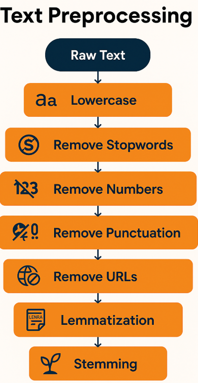
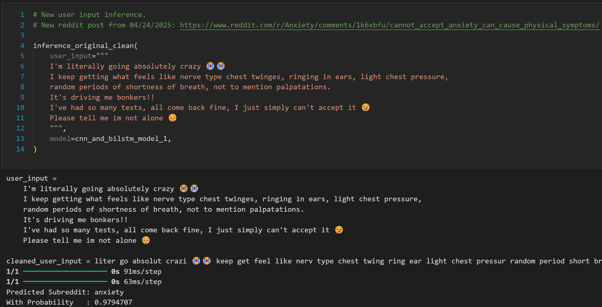

<a name="readme-top"></a>

[![Contributors][contributors-shield]][contributors-url]
[![Forks][forks-shield]][forks-url]
[![Stargazers][stars-shield]][stars-url]
[![Issues][issues-shield]][issues-url]
[![MIT License][license-shield]][license-url]
[![LinkedIn][linkedin-shield]][linkedin-url]
[![GitHub][github-shield]][github-url]

<h1 align="center">Analyzing Mental Health Posts on Social Media: A Deep Learning Approach to Reddit Post Classification</h1>

<br />
<div align="center">
    

<h3 align="center">MINDSCANNER</h3>

  <p align="center">
This project aims to predict a user’s potential <b>mental health condition</b> based on the sentiment and linguistic cues found in <b>Reddit posts</b>. Social media platforms, particularly Reddit, are widely used for expressing emotions and seeking support, often anonymously. Users frequently share personal experiences that may indicate underlying mental health issues such as <b>autism, anxiety, bipolar disorder, borderline personality disorder, dpression, schizophrenia</b>.

To address this, we developed and evaluated <b>deep learning models</b>, including both models built from scratch and <b>fine-tuned transformer-based models</b>. These models were trained on labeled data from dedicated mental health subreddits and optimized for classifying the specific condition associated with each post. We trained and evaluated our models and fine-tuned transformer-based models on two versions of the original data. The first version where we did the cleaning which can found by running the code <a href="https://github.com/GeorgiosIoannouCoder/mindscanner/tree/main/datasets/clean">here</a> and and second version where we apply the transformation on the clean version of the data which can be found by running the code <a href="https://github.com/GeorgiosIoannouCoder/mindscanner/tree/main/datasets/transform">here</a>.

Our work contributes to the field of public mental health by leveraging user-generated content to identify potential mental health conditions. Beyond academic value, this project has real-world implications for <b>improving online mental health support</b>. By accurately classifying Reddit posts according to specific mental health conditions, our models can <b>help guide users toward the most appropriate subreddit communities</b>, where they are more likely to receive relevant support, shared experiences, and information. This can <b>enhance early detection, reduce miscommunication, and improve users’ chances of accessing the right resources or treatment</b> pathways within these online communities.

In total, <b>four models</b> from scratch were developed and <b>TODO:? transformer models</b> were fine-tuned and compared to identify the most effective architecture for detecting a user’s potential <b>mental health condition</b> based on the sentiment and linguistic cues found in <b>Reddit posts</b>. Our best-performing model, a <b>TODO:?</b>, achieved an accuracy of <b>TODO:?%</b>, demonstrating strong potential for real-world deployment in both healthcare and business contexts.
    <br />
    <a href="https://github.com/GeorgiosIoannouCoder/mindscanner"><strong>Explore the docs »</strong></a>
    <br />
    <br />
    <a href="https://github.com/GeorgiosIoannouCoder/mindscanner/issues">Report Bug</a>
    ·
    <a href="https://github.com/GeorgiosIoannouCoder/mindscanner/issues">Request Feature</a>
  </p>
</div>

<details>
  <summary>Table of Contents</summary>
  <ol>
    <li>
      <a href="#about-the-project">About The Project</a>
      <ul>
        <li><a href="#tasks">Tasks</a></li>
        <li><a href="#dataset">Dataset</a></li>
        <li><a href="#cleaning">Cleaning</a></li>
        <li><a href="#Transformation">Transformation</a></li>
        <li><a href="#models-built-with-version-2-of-the-original-data">Models Built With Version 2 of The Original Data</a></li>  
        <li><a href="#models-built-with-version-2-of-the-original-data">Models Built With Version 2 of The Original Data</a></li>        
        <li><a href="#models-performance">Models Performance</a></li>
        <li><a href="#models-weights">Models Weights</a></li>
        <li><a href="#built-with">Built With</a></li>
      </ul>
    </li>
    <li>
      <a href="#getting-started-with-georgios-ioannou-code">Getting Started With Georgios Ioannou Code</a>
      <ul>
        <li><a href="#prerequisites">Prerequisites</a></li>
        <li><a href="#setup">Setup</a></li>
      </ul>
    </li>
    <li>
      <a href="#getting-started-with-zechen-yang-code">Getting Started With Zechen Yang Code</a>
      <ul>
        <li><a href="#prerequisites">Prerequisites</a></li>
        <li><a href="#setup">Setup</a></li>
      </ul>
    </li>
    <li><a href="#usage">Usage</a></li>
    <li><a href="#code-with-plotly-graphs">Code With Plotly Graphs</a></li>
    <li><a href="#paper">Paper</a></li>
    <li><a href="#contributing">Contributing</a></li>
    <li><a href="#license">License</a></li>
    <li><a href="#contact">Contact</a></li>
  </ol>
</details>

## About The Project

  

### Tasks

| Tasks |
| ----- |
| Create Github Repository |
| Brainstorm Project |
| Find Dataset |
| EDA |
| Data Preprocessing and Cleaning |
| Data Modeling: BiLSTM, CNN+BiLSTM, CNN, BiGRU |
| Fine-Tune: TODO:? |
| Model Evaluation |
| Write Paper |

<p align="right"><a href="#readme-top">Back to top</a></p>

### Dataset

**[`Subreddits Dataset For NLP`](https://github.com/GeorgiosIoannouCoder/mindscanner/blob/main/datasets/original/original_dataset.csv)**
- 3 Columns:
  - Title
  - Text
  - Subreddit
- 488,472 rows
- 7 Classes:
  - depression: 58496
  - anxiety: 86243
  - bipolar: 41493
  - mentalhealth: 39373
  - bpd: 38216
  - schizophrenia: 17506
  - autism: 7142
- 2 Versions of Data:
  - Version 1: Clean
  - Version 2: Clean + Transform

<p align="right"><a href="#readme-top">Back to top</a></p>

### Cleaning

***Please note that in our pre-processing we excluded the class "mentalhealth" as it is a more generic class and our models performed better without it.***

***Moreover, we combine the title and text to form our X and use bureddit as our y.***



<p align="right"><a href="#readme-top">Back to top</a></p>

### Transformation

TODO:ADD TEXT/DIAGRAM

<p align="right"><a href="#readme-top">Back to top</a></p>

### Models Built With Version 1 of The Original Data

1. [Bidirectional Long Short-Term Memory (BiLSTM)](https://github.com/GeorgiosIoannouCoder/mindscanner/tree/main/neural_network_models/bilstm_model_1)
2. [Convolutional Neural Network (CNN)](https://github.com/GeorgiosIoannouCoder/mindscanner/tree/main/neural_network_models/cnn_model_1)
3. [CNN + BiLSTM](https://github.com/GeorgiosIoannouCoder/mindscanner/tree/main/neural_network_models/cnn_and_bilstm_model_1)
4. [Bidirectional Gated Recurrent Unit (BiGRU)](https://github.com/GeorgiosIoannouCoder/mindscanner/tree/main/neural_network_models/bigru_model_1)

<p align="right"><a href="#readme-top">Back to top</a></p>

### Models Built With Version 2 of The Original Data

1. [Bidirectional Long Short-Term Memory (BiLSTM)](https://github.com/GeorgiosIoannouCoder/mindscanner/tree/main/neural_network_models/bilstm_model_2)
2. [Convolutional Neural Network (CNN)](https://github.com/GeorgiosIoannouCoder/mindscanner/tree/main/neural_network_models/cnn_model_2)
3. [CNN + BiLSTM](https://github.com/GeorgiosIoannouCoder/mindscanner/tree/main/neural_network_models/cnn_and_bilstm_model_2)
4. [Bidirectional Gated Recurrent Unit (BiGRU)](https://github.com/GeorgiosIoannouCoder/mindscanner/tree/main/neural_network_models/bigru_model_2)

<p align="right"><a href="#readme-top">Back to top</a></p>

### Models Performance

TODO: CREATE DIAGRAM

<p align="right"><a href="#readme-top">Back to top</a></p>

### Models Weights

Please contact me at gi2100@nyu.edu to get the models weights as they were too large to be uploaded in this GitHub repository.

<p align="right"><a href="#readme-top">Back to top</a></p>

### Inference Example



<p align="right"><a href="#readme-top">Back to top</a></p>

### Built With

[![Python][Python]][Python-url]
[![Pandas][Pandas]][Pandas-url]
[![Numpy][Numpy]][Numpy-url]
[![scikitlearn][scikitlearn]][scikitlearn-url]
[![Nltk][Nltk]][Nltk-url]
[![Pytorch][Pytorch]][Pytorch-url]
[![Tensorflow][Tensorflow]][Tensorflow-url]
[![Matplotlib][Matplotlib]][Matplotlib-url]
[![Seaborn][Seaborn]][Seaborn-url]
[![Plotly][Plotly]][Plotly-url]
[![Tensordock][Tensordock]][Tensordock-url]

<p align="right"><a href="#readme-top">Back to top</a></p>

## Getting Started With Georgios Ioannou Code

NOTE: This code was run on a cloud GPU server from [Tensordock](https://tensordock.com) with these specifications:
- 1x h100-sxm5-80gb
- 20x vCPUs
- 64GB RAM
- 300GB NVME STORAGE

**To get a local copy of MINDSCANNER Georgios Ioannou code up and running locally follow these simple example steps:**

### Prerequisites

**NOTE:** How to check if Python is installed and what is its version

```sh
  python --version
```

**NOTE:** How to check if Git is installed and what is its version

```sh
  git -v
```

1. Please make sure you have pyenv installed and use Python3 version 3.12.7:

   - You can use pyenv to switch between different Python versions:
     - Windows: [https://www.youtube.com/watch?v=HTx18uyyHw8](https://github.com/pyenv-win/pyenv-win)
     - Mac: [https://www.youtube.com/watch?v=31WU0Dhw4sk](https://github.com/pyenv/pyenv)
     - Linux: [https://www.youtube.com/watch?v=1Zgo8M9yUtM](https://github.com/pyenv/pyenv)

2. Please make sure you have git installed

   - Windows: [https://git-scm.com/download/win](https://git-scm.com/download/win)
   - Mac: [https://git-scm.com/download/mac](https://git-scm.com/download/mac)
   - Linux: [https://git-scm.com/download/linux](https://git-scm.com/download/linux)

3. Please make sure you have Anaconda installed

   - Windows: [https://www.anaconda.com/docs/getting-started/anaconda/install#windows-installation](https://www.anaconda.com/docs/getting-started/anaconda/install#windows-installation)
   - Mac: [https://www.anaconda.com/docs/getting-started/anaconda/install#macos-linux-installation](https://www.anaconda.com/docs/getting-started/anaconda/install#macos-linux-installation)
   - Linux: [https://www.anaconda.com/docs/getting-started/anaconda/install#linux-installer](https://www.anaconda.com/docs/getting-started/anaconda/install#linux-installer)

### Setup

1. Navigate to the directory where you want to clone/run/save the application:

   ```sh
   cd your_selected_directory
   ```

2. Clone this repository:

   ```sh
   git clone https://github.com/GeorgiosIoannouCoder/mindscanner.git
   ```

3. Navigate to the mindscanner git repository:

   ```sh
   cd mindscanner
   ```

4. Create a new conda environment in the cloned repository folder:

   ```sh
   conda env create -f environment.yml
   ```

5. Activate the conda environment:

   ```sh
   conda activate mindscanner-venv
   ```

6. To Run The Jupyter Notebook and Code Files on GPU (2 Main Options):
   1. Use [Kaggle](https://www.kaggle.com) - **Free**
   2. Rent a cloud GPU server like [Tensordock](https://tensordock.com) and SSH to [Jupyter Notebook Extension for VS Code](https://code.visualstudio.com/docs/datascience/jupyter-notebooks) - **NOT Free**

7. The Jupyter Notebook [here](https://github.com/GeorgiosIoannouCoder/mindscanner/blob/main/code/georgios_ioannou/bilstm_cnnbilstm_cnn_gru.ipynb) can be run step by step as it include the entire code for the follwoing models: BiLSTM, CNN + BiLSTM, CNN, and BiGRU.
   
8. In case you just want to clean the data use the code [here](https://github.com/GeorgiosIoannouCoder/mindscanner/blob/main/datasets/clean/clean_data.py) and in case you aslo want to transform it, then use the code [here](https://github.com/GeorgiosIoannouCoder/mindscanner/blob/main/datasets/transform/transform_data.py). Please note that you first have to clean adn then transform as the transformation hasppens on the cleaned data. 

<p align="right"><a href="#readme-top">Back to top</a></p>

## Getting Started With Zechen Yang Code

<p align="right"><a href="#readme-top">Back to top</a></p>

## Code With Plotly Graphs

The full code for BiLSTM, CNN + BiLSTM, CNN, and BiGRU with all the Plotly interactive graphs can be found [here](https://nbviewer.org/github/GeorgiosIoannouCoder/mindscanner/blob/main/code/georgios_ioannou/bilstm_cnnbilstm_cnn_gru.ipynb). In case you have issues opening it is due to the fact that there is a lot of output making the .ipynb file size large. THe solution os to download the .ipynb [here](https://github.com/GeorgiosIoannouCoder/mindscanner/blob/main/code/georgios_ioannou/bilstm_cnnbilstm_cnn_gru.ipynb) and open it locally.

<p align="right"><a href="#readme-top">Back to top</a></p>

## Paper

Project Final Paper is located [here](https://github.com/GeorgiosIoannouCoder/mindscanner/blob/main/paper/Ioannou_Georgios_Report.pdf).

<p align="right"><a href="#readme-top">Back to top</a></p>

## Contributing

Contributions are what make the open source community such an amazing place to learn, inspire, and create. Any contributions you make are **greatly appreciated**.

If you have a suggestion that would make this better, please fork the repo and create a pull request. You can also simply open an issue with the tag "enhancement".
Don't forget to give the project a star! Thanks again!

1. Fork the Project
2. Create your Feature Branch (`git checkout -b feature/AmazingFeature`)
3. Commit your Changes (`git commit -m 'Add some AmazingFeature'`)
4. Push to the Branch (`git push origin feature/AmazingFeature`)
5. Open a Pull Request

<p align="right"><a href="#readme-top">Back to top</a></p>

## License

Distributed under the MIT License. See [LICENSE](https://github.com/GeorgiosIoannouCoder/mindscanner/blob/master/LICENSE) for more information.

MIT License

Copyright (c) 2025 Georgios Ioannou

Permission is hereby granted, free of charge, to any person obtaining a copy
of this software and associated documentation files (the "Software"), to deal
in the Software without restriction, including without limitation the rights
to use, copy, modify, merge, publish, distribute, sublicense, and/or sell
copies of the Software, and to permit persons to whom the Software is
furnished to do so, subject to the following conditions:

The above copyright notice and this permission notice shall be included in all
copies or substantial portions of the Software.

THE SOFTWARE IS PROVIDED "AS IS", WITHOUT WARRANTY OF ANY KIND, EXPRESS OR
IMPLIED, INCLUDING BUT NOT LIMITED TO THE WARRANTIES OF MERCHANTABILITY,
FITNESS FOR A PARTICULAR PURPOSE AND NONINFRINGEMENT. IN NO EVENT SHALL THE
AUTHORS OR COPYRIGHT HOLDERS BE LIABLE FOR ANY CLAIM, DAMAGES OR OTHER
LIABILITY, WHETHER IN AN ACTION OF CONTRACT, TORT OR OTHERWISE, ARISING FROM,
OUT OF OR IN CONNECTION WITH THE SOFTWARE OR THE USE OR OTHER DEALINGS IN THE
SOFTWARE.

<p align="right"><a href="#readme-top">Back to top</a></p>

## Contact

Georgios Ioannou - [@LinkedIn](https://linkedin.com/in/georgiosioannoucoder)

Project Link: [https://github.com/GeorgiosIoannouCoder/mindscanner](https://github.com/GeorgiosIoannouCoder/mindscanner)

<p align="right"><a href="#readme-top">Back to top</a></p>

[contributors-shield]: https://img.shields.io/github/contributors/GeorgiosIoannouCoder/mindscanner.svg?style=for-the-badge
[contributors-url]: https://github.com/GeorgiosIoannouCoder/mindscanner/graphs/contributors

[forks-shield]: https://img.shields.io/github/forks/GeorgiosIoannouCoder/mindscanner.svg?style=for-the-badge
[forks-url]: https://github.com/GeorgiosIoannouCoder/mindscanner/network/members

[stars-shield]: https://img.shields.io/github/stars/GeorgiosIoannouCoder/mindscanner.svg?style=for-the-badge
[stars-url]: https://github.com/GeorgiosIoannouCoder/mindscanner/stargazers

[issues-shield]: https://img.shields.io/github/issues/GeorgiosIoannouCoder/mindscanner.svg?style=for-the-badge
[issues-url]: https://github.com/GeorgiosIoannouCoder/mindscanner/issues

[license-shield]: https://img.shields.io/github/license/GeorgiosIoannouCoder/mindscanner.svg?style=for-the-badge
[license-url]: https://github.com/GeorgiosIoannouCoder/mindscanner/blob/master/LICENSE

[linkedin-shield]: https://img.shields.io/badge/-LinkedIn-black.svg?style=for-the-badge&logo=linkedin&colorB=0077B5
[linkedin-url]: https://linkedin.com/in/georgiosioannoucoder

[github-shield]: https://img.shields.io/badge/-GitHub-black.svg?style=for-the-badge&logo=github&colorB=000
[github-url]: https://github.com/GeorgiosIoannouCoder/

[Python]: https://img.shields.io/badge/python-FFDE57?style=for-the-badge&logo=python&logoColor=4584B6
[Python-url]: https://www.python.org/

[Pandas]: https://img.shields.io/badge/pandas-150458?style=for-the-badge&logo=pandas&logoColor=white
[Pandas-url]: https://pandas.pydata.org/

[Numpy]: https://img.shields.io/badge/numpy-%23013243.svg?style=for-the-badge&logo=numpy&logoColor=white
[Numpy-url]: https://numpy.org/

[scikitlearn]: https://img.shields.io/badge/scikitlearn-000000?style=for-the-badge&logo=scikitlearn&logoColor=ffa500
[scikitlearn-url]: https://scikit-learn.org/stable/

[Nltk]: https://img.shields.io/badge/nltk-154f5b?style=for-the-badge&logo=nltk&logoColor=ffa500
[Nltk-url]: https://www.nltk.org/

[Pytorch]: https://img.shields.io/badge/pytorch-000000?style=for-the-badge&logo=pytorch&logoColor=ee4c2c
[Pytorch-url]: https://www.pytorch.org/

[Tensorflow]: https://img.shields.io/badge/tensorflow-000000?style=for-the-badge&logo=tensorflow&logoColor=ffa500
[Tensorflow-url]: https://www.tensorflow.org/

[Matplotlib]: https://img.shields.io/badge/matplotlib-3761a3?style=for-the-badge&logo=matplotlib&logoColor=white
[Matplotlib-url]: https://matplotlib.org/

[Seaborn]: https://img.shields.io/badge/seaborn-7db0bc?style=for-the-badge&logo=seaborn&logoColor=white
[Seaborn-url]: https://seaborn.pydata.org/

[Plotly]: https://img.shields.io/badge/plotly-000000?style=for-the-badge&logo=plotly&logoColor=white
[Plotly-url]: https://plotly.com/

[Tensordock]: https://img.shields.io/badge/tensordock-6cbc64?style=for-the-badge&logo=tensordock&logoColor=000000
[Tensordock-url]: https://www.tensordock.com/