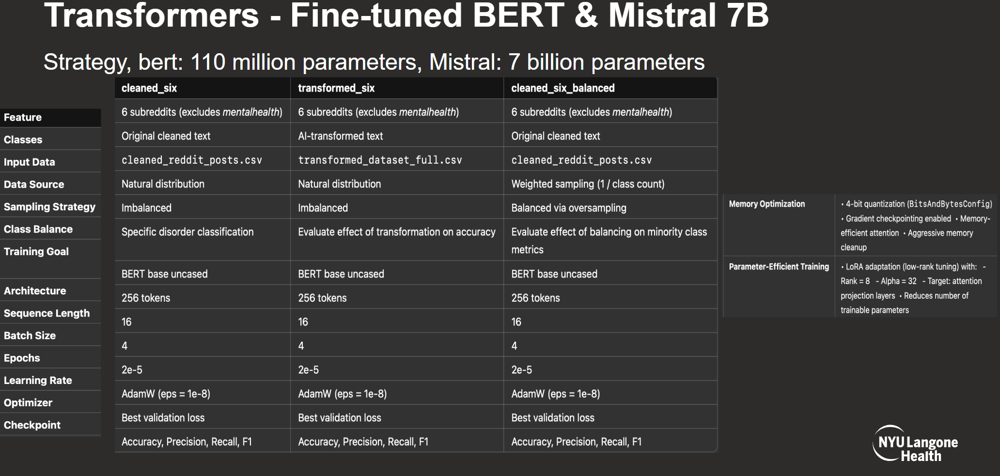
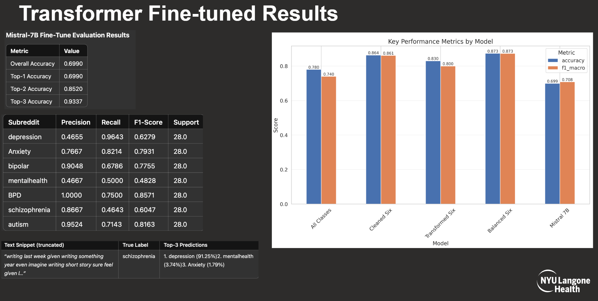

# BERT Mental Health Classification Training

## Setup Instructions

1. **Environment Setup**:
   ```bash
   # Create and activate conda environment
   conda create -n bert python=3.10
   conda activate bert

   # Install PyTorch with CUDA
   conda install pytorch pytorch-cuda=12.1 -c pytorch -c nvidia

   # Install other requirements
   pip install -r requirements.txt
   ```

2. **Directory Setup**:
   ```bash
   # Create necessary directories
   mkdir -p ./model_all_classes
   mkdir -p ./model_cleaned_six
   mkdir -p ./model_cleaned_six_balanced
   mkdir -p ./model_transformed_six
   ```

3. **Data Preparation**:
   - Place `cleaned_reddit_posts.csv` in the parent directory
   - Place `transformed_dataset_full.csv` in the parent directory for the transformed model

4. **Start Training**:
   ```bash
   # Train on all 7 subreddits
   python train_bert_all_classes.py

   # Train on 6 subreddits (excluding mentalhealth) with cleaned data
   python train_bert_cleaned_six.py

   # Train on 6 subreddits with class balancing
   python train_bert_balanced_six.py

   # Train on 6 subreddits with transformed data
   python train_bert_transformed_six.py
   ```

## Requirements

- CUDA-capable GPU with at least 8GB VRAM
- At least 16GB system RAM
- Python 3.8 or later
- Dependencies in requirements.txt

## Available Models

1. **All Classes (7 Subreddits)**
   - Script: `train_bert_all_classes.py`
   - Output: `./model_all_classes/`
   - Classifies posts from 7 subreddits: depression, Anxiety, bipolar, mentalhealth, BPD, schizophrenia, autism

2. **Cleaned Six (6 Subreddits)**
   - Script: `train_bert_cleaned_six.py`
   - Output: `./model_cleaned_six/`
   - Classifies posts from 6 subreddits (excluding mentalhealth) using cleaned text

3. **Balanced Six (6 Subreddits with Class Balancing)**
   - Script: `train_bert_balanced_six.py`
   - Output: `./model_cleaned_six_balanced/`
   - Uses WeightedRandomSampler to handle class imbalance

4. **Transformed Six (6 Subreddits with Transformed Data)**
   - Script: `train_bert_transformed_six.py`
   - Output: `./model_transformed_six/`
   - Uses transformed text from the `transformed_dataset_full.csv` file

## Model Configuration

All models use the following configuration:
- Base model: bert-base-uncased
- Max sequence length: 256
- Batch size: 16
- Learning rate: 2e-5
- Training epochs: 4

## Output Structure

Each model directory contains:
- The trained model files
- `label_mapping.txt` file that maps subreddit names to label IDs 

<div align="center">
    
</div>

<div align="center">
    
</div>

<div align="center">
    
</div>