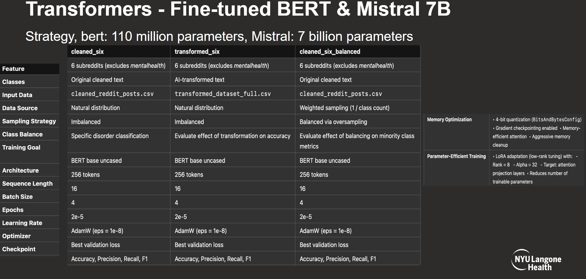
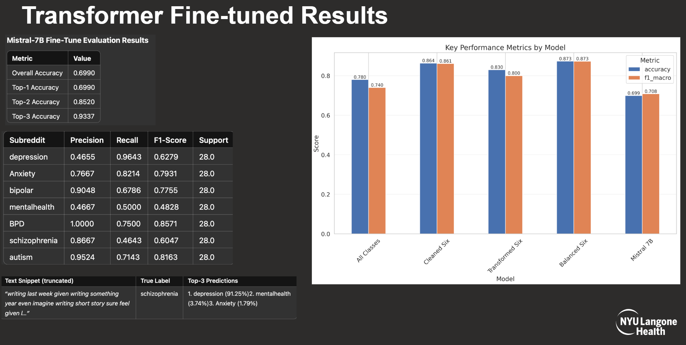
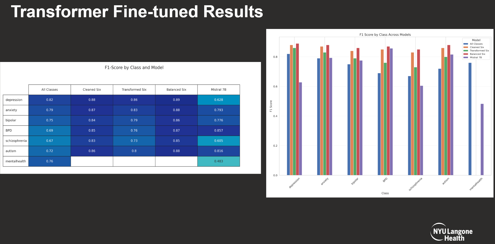

# Mistral Mental Health Classification Training

## Setup Instructions

1. **Environment Setup**:
   ```bash
   # Create and activate conda environment
   conda create -n mistral python=3.10
   conda activate mistral

   # Install PyTorch with CUDA
   conda install pytorch pytorch-cuda=12.1 -c pytorch -c nvidia

   # Install other requirements
   pip install -r requirements.txt
   ```

2. **Directory Setup**:
   ```bash
   # Create necessary directories
   mkdir -p /mnt/mistral_data/mistral_mental_health
   mkdir -p /mnt/mistral_data/huggingface_cache
   mkdir -p /mnt/mistral_data/huggingface_home
   ```

3. **HuggingFace Token Setup**:
   ```bash
   # Set your HuggingFace token
   export HUGGING_FACE_HUB_TOKEN='your_token_here'
   ```

4. **Data Preparation**:
   - Place `cleaned_reddit_posts.csv` in the same directory as `train_mistral.py`

5. **Start Training**:
   ```bash
   python train_mistral.py
   ```

## Requirements

- CUDA-capable GPU with at least 16GB VRAM
- At least 32GB system RAM
- Ubuntu 20.04 or later
- Python 3.10 or later

## Files Needed
- train_mistral.py
- requirements.txt
- cleaned_reddit_posts.csv

## Output Location
Training outputs will be saved to `/mnt/mistral_data/mistral_mental_health/`

<div align="center">
    
</div>

<div align="center">
    
</div>

<div align="center">
    
</div>